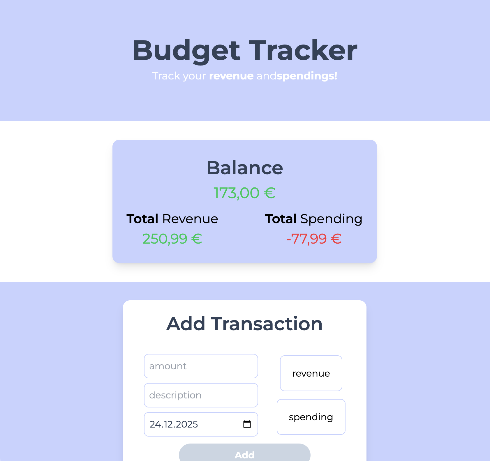
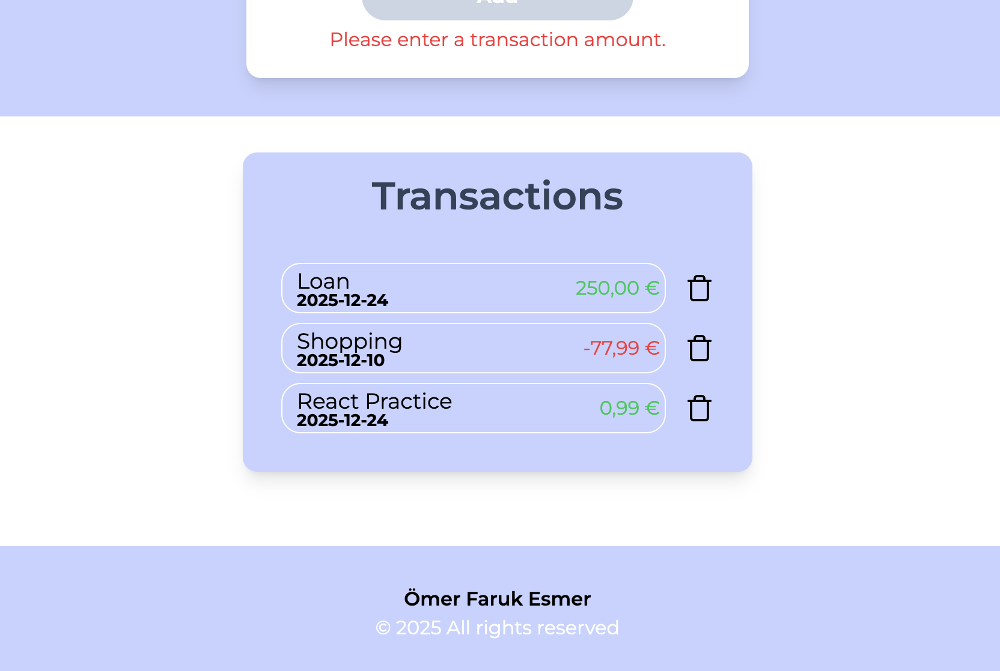

# Budget Tracker

A clean and simple web application for managing personal finances.  
Originally built with Vanilla JavaScript, this project has been refactored into a modern React application to improve scalability, maintainability, and developer experience.

---

## Features

- **Add Transactions**  
  Record income (revenue) and expenses (spending) with an amount, date, and description.

- **Dynamic Overview**  
  Automatic calculation and real-time display of total balance, total revenue, and total spending derived from the transaction list.

- **Visual Feedback**  
  Color-coded transaction types provide a quick and clear financial overview.

- **Delete Transactions**  
  Remove individual transactions safely using stable ID tracking.

- **Data Persistence**  
  Transactions are synchronized with the browser’s Local Storage, ensuring data remains available after page reloads.

- **Input Validation**  
  The form prevents submission until all required fields (amount, type, date, description) are valid.

- **Smart Amount Formatting**  
  Input sanitization allows only numeric characters and a single decimal separator, limited to two decimal places.

---

## Technologies Used

- **React**  
  Component-based UI development using Hooks (`useState`, `useEffect`).

- **TypeScript**  
  Strong typing and clearly defined interfaces for transaction data.

- **Tailwind CSS**  
  Utility-first styling for fast and responsive UI development.

- **Vite**  
  Fast development server and optimized production builds.

---

## Technical Highlights

- **Derived State Logic**  
  Financial totals are calculated dynamically from the transaction array, ensuring a single source of truth.

- **Controlled Components**  
  All form inputs are fully controlled via React state for reliable validation and predictable behavior.

- **Lazy State Initialization**  
  Local Storage is accessed only once during initial state creation to avoid unnecessary re-renders.

---

## Screenshots

---
